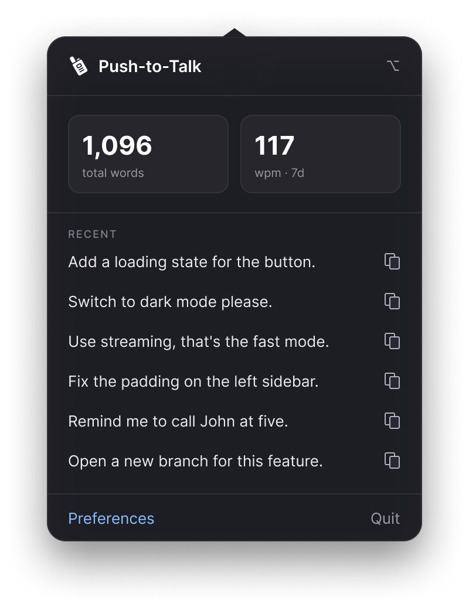
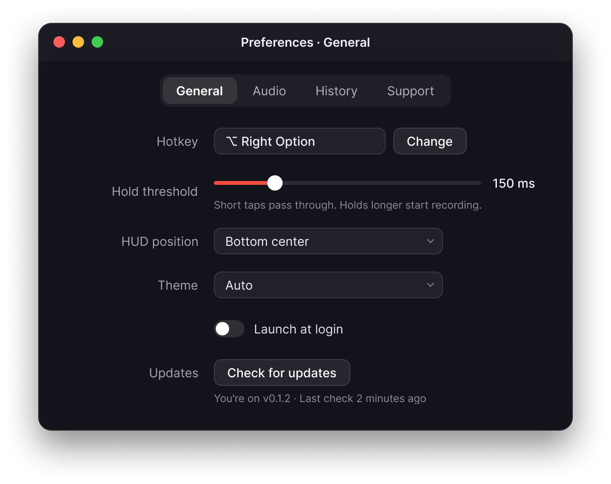
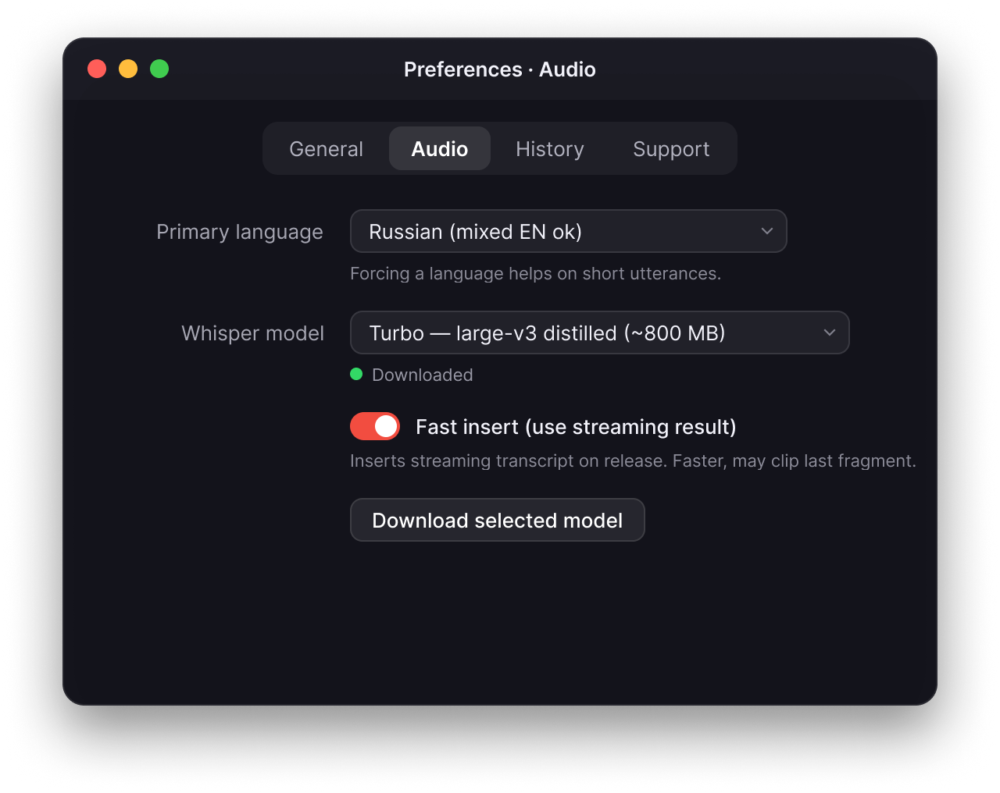
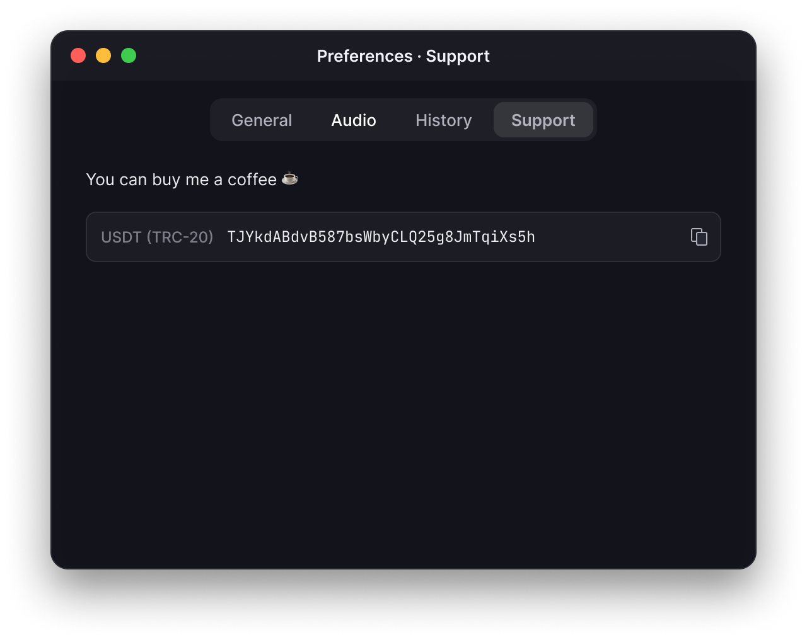

# Push-to-Talk

Local push-to-talk dictation for macOS. Hold the hotkey, speak, release — recognized text is inserted into the focused input. No cloud: Whisper runs on GPU via WhisperKit.

<p align="center">
  
</p>

## Features

- **Push-to-talk** on Right Option or Right Cmd (configurable)
- **Local transcription** through WhisperKit (CoreML, GPU)
- **Code-switching RU/EN/UK and more** — in auto mode the language is chosen only from the ones you have in System Settings → Language & Region
- **Insertion without clipboard** — via `CGEventKeyboardSetUnicodeString`; password fields are skipped
- **Menu bar popover** with the last 10 transcriptions (click to copy) and metrics: total words, 7-day avg WPM
- **HUD overlay** while you hold the key: black pill with a live mic level or a live transcript
- **Light text cleanup** — trims long "eeeeee / mmmmm / ummm", collapses 3+ consecutive repeats, capitalizes the first letter and adds a period

## Install

Grab the latest DMG from the [Releases page](https://github.com/timmal/push-to-talk/releases/latest), open it, and drag `PushToTalk.app` into `Applications`.

Because the app is self-signed, the first launch needs `Control-click → Open` once (macOS will warn about an unidentified developer). After that it launches normally.

On first launch, grant three permissions:

- **Microphone** — for audio capture
- **Accessibility** — for the global hotkey and text insertion
- **Input Monitoring** — to use Right Option / Right Cmd (or the hotkey you choose) as push-to-talk

The onboarding window has Open… and Re-check buttons.

### Updating

The app checks GitHub for new versions in the background and shows an **Update available** banner in the menu bar popover. You can also trigger a check manually via Preferences → General → **Check for updates**.

1. Click **Download** in the banner — it opens the latest release on GitHub.
2. Download the `.dmg`, open it, and drag `PushToTalk.app` into `Applications`. macOS will ask to replace the old copy — confirm.
3. Quit the running app from the menu bar (Quit), then launch the new one from `Applications`.

Your preferences, history, and downloaded models live in `~/Library/Application Support/PushToTalk/` and are preserved across updates.

### Model

The default is **Turbo (large-v3 distilled, ~800 MB)** — the best quality/speed trade-off. You can switch to Tiny or Small in Preferences → Audio.

If you already have MacWhisper / another WhisperKit client installed, their models will be picked up automatically. Otherwise the first model is downloaded to `~/Library/Application Support/PushToTalk/Models/`.

### Reducing insertion latency

The delay between releasing the hotkey and text appearing in the input is dominated by the Whisper forward pass. Two levers:

- **Pick a smaller model.** Preferences → Audio → *Whisper model*:
  - **Tiny (~40 MB)** — fastest (~80–150 ms on Apple Silicon for a short utterance), lowest quality. Good for quick English/single-language dictation.
  - **Small (~250 MB)** — middle ground.
  - **Turbo (~800 MB)** — default; best quality but ~400–800 ms per utterance.
- **Set a fixed language** instead of Auto. Preferences → Audio → *Primary language*: picking Russian or English skips an extra language-detection forward pass that Auto mode runs before transcription.

Combining **Tiny + explicit language** gives the lowest end-to-end latency. Combining **Turbo + Auto** gives the best quality but is the slowest path.

## Usage

1. Hold **Right Option** (or whatever you set in Preferences).
2. Speak. A HUD appears in the top right corner (or bottom center — configurable) showing the mic level.
3. Release the key. After ~1–2 s the text is inserted into the focused field.
4. If the field lost focus — open the menu bar icon: it shows the last 10 transcriptions; click to copy.

### Short taps

By default, presses shorter than **150 ms** don't start recording — the key behaves as a normal Option. The threshold is configurable in Preferences → General (50–800 ms).

## Preferences

- **General** — hotkey, hold threshold, HUD position (under the icon / bottom center), theme (Auto / Light / Dark), launch at login, update check
- **Audio** — language (Auto / Russian / English), Whisper model, Fast insert (streaming), model download
- **History** — clear history and reset metrics
- **Support** — donation address (USDT TRC-20)

<p align="center">
  
  <br /><br />
  
  <br /><br />
  
</p>

### Auto language detection

In Auto mode the app reads `Locale.preferredLanguages` from the system and restricts Whisper to those languages only. So if macOS has RU, EN, UK enabled, Whisper will pick among them and won't drift into, say, Bulgarian.

## Architecture

- `Sources/Core` — pure logic (hotkey, recorder, inserter, text cleaner, storage, metrics, model manager)
- `Sources/Whisper` — thin wrapper around WhisperKit
- `Sources/UI` — SwiftUI: menu bar popover, preferences, onboarding, HUD
- `Sources/App` — AppDelegate and entry point

Transcription history is stored in a GRDB-SQLite database at `~/Library/Application Support/PushToTalk/history.sqlite`.

## Logs

Diagnostic events go to `~/Library/Logs/PushToTalk.log`. Useful for microphone / language detection / hotkey issues:

```bash
tail -f ~/Library/Logs/PushToTalk.log
```

## Troubleshooting

**Hotkey doesn't fire.** Check Input Monitoring and Accessibility in System Settings → Privacy & Security. When the signature changes (e.g. a fresh ad-hoc build) TCC may drop entries — delete and re-add, or run `scripts/setup-signing.sh` and rebuild.

**Recognizes silence / empty result.** Check the input level in System Settings → Sound → Input. In the logs, look at `finalize: rms=...` — normal speech is ≥ 0.02. If you see `0.0005` the mic is quiet (wrong device / muted / mic TCC not granted).

**Confuses Ukrainian / Russian with English in auto.** Auto relies on `Locale.preferredLanguages`. Make sure the language is actually listed in System Settings → Language & Region, or switch Preferences → Audio from Auto to an explicit Russian / English.

**TCC permissions reset on every rebuild.** You haven't run `scripts/setup-signing.sh` yet. It creates a persistent self-signed certificate in the login keychain. After that every rebuild is signed with the same key, and macOS treats it as the same app.

## License

MIT.
